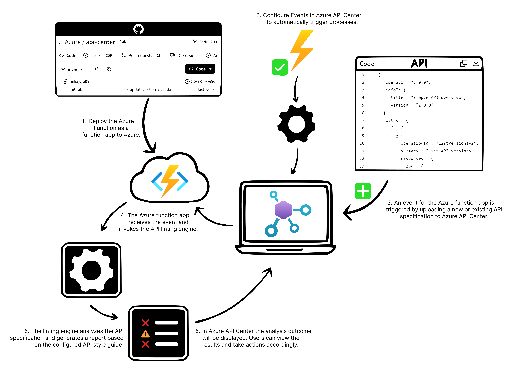

# Analyze your API Specs with Azure API Center (Preview)

## Overview

- :bulb: [What is Azure API Center?](#bulb-what-is-azure-api-center)
  - :briefcase: API Governance & Azure API Center
  - :briefcase: API Analysis in Azure API Center (Overview)
- :rocket: [How to Run](#rocket-how-to-set-up-api-analysis)
  - :wrench: How to deploy
  - :cloud: How to debug your function locally
- :page_facing_up: [Custom Ruleset](#page_facing_up-custom-rulesets)
- :computer: [Support](#computer-support)
- :pencil2: [Contributing](#pencil2-contributing)
- :book: [Code of Conduct](#book-code-of-conduct)
- :v: [Trademark Notice](#v-trademark-notice)
- :bar_chart: [Telemetry](#bar_chart-telemetry)

## :bulb: What is Azure API Center?

[Azure API Center](https://learn.microsoft.com/en-us/azure/api-center/overview) is a service that helps you develop and maintain a structured inventory of your organization’s APIs. With API Center, you can track all of your APIs in a centralized location, regardless of their type, lifecycle stage, or deployment location. API Center enables API discovery, reuse, and governance empowering API Platform Teams.

### :briefcase: API Governance & Azure API Center

API governance is a critical aspect of managing APIs across an organization. It involves establishing and enforcing policies and procedures that guarantee the quality, consistency, security, and compliance of APIs. Effective API governance not only maximizes the value of an organization's API portfolio but also reduces complexity, eliminates redundancy, and mitigates potential risks.

For API Platform Teams, governance is crucial as it guides them in designing, building, and deploying APIs that align with the organization's objectives, standards, and best practices.

To facilitate robust API governance, we're excited to introduce **API Analysis** in Azure API Center. API Analysis employs API linting, a technique that validates your API specifications against a predefined set of rules or standards. With API Analysis, you can ensure your APIs adhere to your organization's guidelines and best practices, making them consistently secure and compliant.

> API Analysis currently supports OpenAPI v2, v3.x, and AsyncAPI specifications uploaded as JSON or YAML files.

### :briefcase: API Analysis in Azure API Center (Overview)

Here is a high-level overview of how API analysis works in Azure API Center


## :rocket: How to set up API Analysis

### :wrench: Configure your environment

Before you get started, make sure you have the following requirements in place:

- An Azure account with an active subscription. [Create an account for free](https://azure.microsoft.com/free).
- An API Center instance.
- [Visual Studio Code](https://code.visualstudio.com/) on one of the [supported platforms](https://code.visualstudio.com/docs/supporting/requirements#_platforms).
- The [Azure Functions extension v1.10.4](https://marketplace.visualstudio.com/items?itemName=ms-azuretools.vscode-azurefunctions) or above for Visual Studio Code.
- [Azure Developer CLI](https://learn.microsoft.com/azure/developer/azure-developer-cli/install-azd)
- [Azure CLI](https://learn.microsoft.com/cli/azure/install-azure-cli)

### :cloud: How to deploy

Follow the instructions in [Quickstart: Create a function in Azure with TypeScript using Visual Studio Code](https://learn.microsoft.com/en-us/azure/azure-functions/create-first-function-vs-code-typescript?pivots=nodejs-model-v4#sign-in-to-azure). Start from the "Sign in to Azure" section and complete all subsequent sections.

Alternatively, if you'd like to use [Azure Developer CLI](https://learn.microsoft.com/azure/developer/azure-developer-cli/install-azd), run the following steps:

1. Login to Azure by running the commands below in your terminal:

    ```bash
    az login
    azd auth login
    ```

1. Initialize your Azure environment by running the command below:

    ```bash
    azd init
    ```

   While you're running `azd init`, you will be asked to provide:

   - An environment name: Any name you want to give to your environment.
   - A template: Choose the `Minimal template` option. <!-- This option will be changed to "API Center Analyzer" once this PR is merged, which is not available at this time of PR -->

1. Run the following command to provision and deploy this analyzer to Azure:

    ```bash
    azd up
    ```

   While you're running `azd up`, you will be asked to provide:

   - Azure subscription
   - Location to provision resources
   - The `apicName` parameter: Enter the API Center instance name to connect the analyzer to &ndash; if it's provided, the analyzer will be attached to the API Center instance; otherwise, a new API Center instance will be provisioned and connected.
   - The `useMonitoring` parameter: Choose `yes` or `no` &ndash; if you choose `yes`, both Application Insights and Log Analytics will be provisioned; otherwise, both won't be provisioned.

   You will get the following Azure resources provisioned:

   - Azure Functions
   - Storage Account
   - API Center (if `apicName` is not provided)
   - Application Insights (if `useMonitoring` is set to `yes`)
   - Log Analytics (if `useMonitoring` is set to `yes`)

### :wrench: Configure & run your function locally

To debug your Azure function locally. You'll need the following dependencies:

- [Node.js 18.x](https://nodejs.org/en/download/releases/) or above. Use the `node --version` command to check your version.
- [TypeScript 4.x](https://www.typescriptlang.org/). Use the `tsc -v` command to check your version.
- [Azure Functions Core Tools v4.0.5382 or above](https://learn.microsoft.com/azure/azure-functions/functions-run-local?tabs=windows%2Cisolated-process%2Cnode-v4%2Cevent-grid-trigger&pivots=programming-language-typescript#install-the-azure-functions-core-tools).

After the dependencies are installed, follow these steps to debug the event triggered Azure function:

- Open the Project in Visual Studio Code
- Set a breakpoint
- To start the function locally, press `F5` or the Run and Debug icon in the left-hand side Activity bar. The Terminal panel should display the Output from Azure Functions Core Tools.
- Follow the instructions in [Test your Event Grid handler locally](https://learn.microsoft.com/en-us/azure/communication-services/how-tos/event-grid/local-testing-event-grid) to trigger the function.

## :page_facing_up: Custom rulesets

This template provides you with the default OAS (OpenAPI Specification) ruleset from Spectral. To see the exact rules within the ruleset, see [OpenAPI Rules](https://docs.stoplight.io/docs/spectral/4dec24461f3af-open-api-rules).

If you want to customize your Ruleset for analysis, simply swap out the default ruleset file oas.yaml located in `{workSpaceFolder}/resources/rulesets` with any valid Spectral ruleset file. We accept all valid Spectral formats (YAML, JSON). Afterward, head over to the `{workSpaceFolder}/src/constants.ts` file and update the `RulesetFileName` constant with your chosen ruleset file name.

## :computer: Support

See [SUPPORT.md](./SUPPORT.md)

## :pencil2: Contributing

See [the contribution guidelines](CONTRIBUTING.md) for ideas and guidance on how to improve the template. Thank you!

## :book: Code of Conduct

This project has adopted the [Microsoft Open Source Code of Conduct](https://opensource.microsoft.com/codeofconduct/). For more information see the [Code of Conduct FAQ](https://opensource.microsoft.com/codeofconduct/faq/) or contact [opencode@microsoft.com](mailto:opencode@microsoft.com) with any additional questions or comments.

## :v: Trademark Notice

Trademarks This project may contain trademarks or logos for projects, products, or services. Authorized use of Microsoft trademarks or logos is subject to and must follow Microsoft’s Trademark & Brand Guidelines. Use of Microsoft trademarks or logos in modified versions of this project must not cause confusion or imply Microsoft sponsorship. Any use of third-party trademarks or logos are subject to those third-party’s policies.

## :bar_chart: Telemetry

Data Collection. The software may collect information about you and your use of the software and send it to Microsoft. Microsoft may use this information to provide services and improve our products and services. You may turn off the telemetry as described in the repository. There are also some features in the software that may enable you and Microsoft to collect data from users of your applications. If you use these features, you must comply with applicable law, including providing appropriate notices to users of your applications together with a copy of Microsoft’s privacy statement. Our privacy statement is located at <https://go.microsoft.com/fwlink/?LinkID=824704>. You can learn more about data collection and use in the help documentation and our privacy statement. Your use of the software operates as your consent to these practices.

## License

[MIT](LICENSE.txt)
